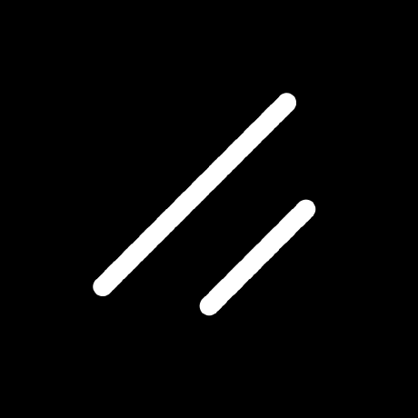
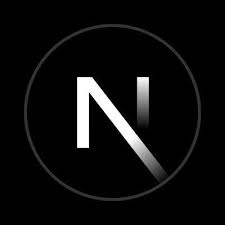

<!-- Banner Section -->

<!-- Introduction Section -->
<h1 align="center">Hi 👋, I'm Arko</h1>

### 
A passionate MERN Stack Developer crafting dynamic web applications using modern technologies like React, Express, and MongoDB. Problem-solving and continuous learning fuel my journey.

---

<!-- Profile Stats Section -->

  
  

---

<!-- GitHub Stats Section -->

## :chart_with_upwards_trend: Current Stats

 

  

 

<!-- Social Links Section -->

## 🔗 Connect with Me

  
  

 
<!-- Technologies Section -->
## :computer: Technologies that I know

 

  <!-- Frontend Technologies -->
  
  
  
  
  
  
  

  <!-- Frameworks and Programming Languages -->
  
  
  
  
  

  <!-- Backend Technologies -->
  
  
  

 
<!-- Overview Section -->

## :eyes: Current overview

### 🔭 I’m working - As a Student Ambassador.

### 🌱 I’m exploring - Advanced motion graphics for the web.

### 👯 I’m looking - For job opportunities and to collaborate on open source projects.

### 🤔 I’m trying - To help people learn web development.

### ⚡ Fun fact - I’m a MERN stack developer, I love to make complex origami, and I can speak 5 languages.
