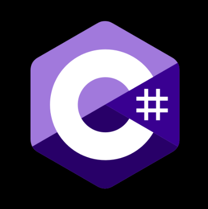

<!-- Banner Section -->

<!-- Introduction Section -->
<h1 align="center">Hi 👋, I'm Arko</h1>

### 
Backend-focused Software Engineer (ASP.NET Core) building scalable systems, with full-stack experience in React and Node.js.

---

<!-- Profile Stats Section -->

  
  

---

<!-- GitHub Stats Section -->

## :chart_with_upwards_trend: Current Stats

 

  

 

<!-- Social Links Section -->

## 🔗 Connect with Me

  
  

 
<!-- Technologies Section -->

## 💻 Technologies that I know

 

  <!-- Frontend Technologies -->
  
  
  
  
  
  
  

  <!-- Frameworks and Programming Languages -->
  
  
  
  
  
  

  <!-- Backend Technologies -->
  
  
  
  

 
<!-- Overview Section -->

## :eyes: Current overview

### 🔭 I’m working - As a Software Engineer (Backend-focused, ASP.NET Core).

### 🌱 I’m focused on - System design, performance optimization, and scalable backend architecture.

### 👯 I’m open to - Backend roles, high-impact systems, and open-source contributions.

### 🤔 I’m building - Production-ready APIs with caching, async processing, and optimized databases.

### ⚡ Fun fact - I enjoy solving complex backend problems and designing systems that scale.